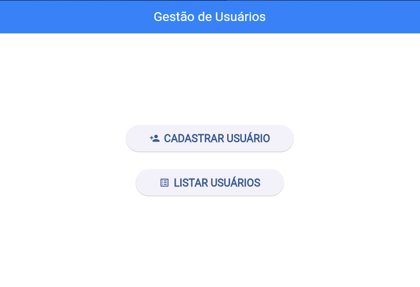
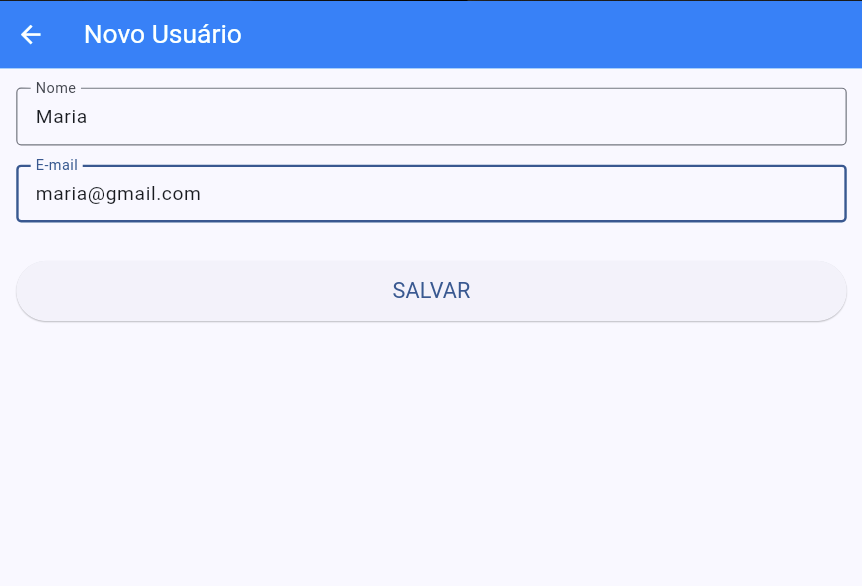
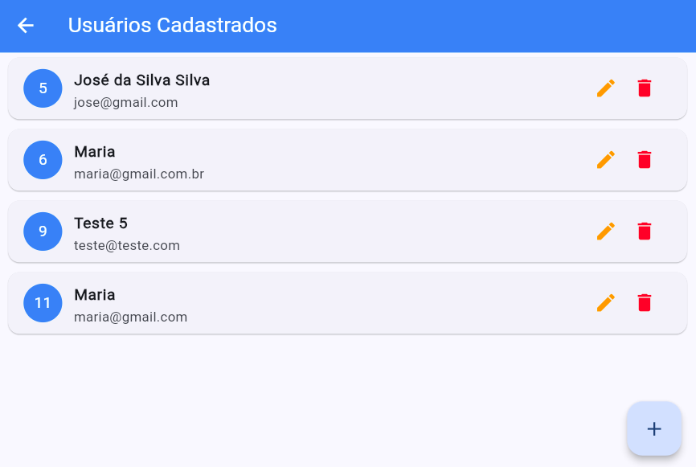

# 🚀 CRUD de Usuários — Flutter + Node.js

Aplicação completa de CRUD (Create, Read, Update, Delete) utilizando:

* 📱 Frontend: Flutter (Web)
* 🌐 Backend: Node.js + Express
* 🗄️ Banco de dados: PostgreSQL

---

## 📸 Demonstração	





---

## 🧠 Funcionalidades

* ✅ Listar usuários
* ✅ Cadastrar usuário
* ✅ Atualizar usuário
* ✅ Deletar usuário

---

## 🏗️ Arquitetura

```
Flutter (Frontend) → API REST → Node.js → PostgreSQL
```

---

## ⚙️ Tecnologias utilizadas

* Flutter
* Dart
* Node.js
* Express
* PostgreSQL

---

## 🚀 Como executar o projeto

### 🔹 Backend

```bash
cd backend
docker compose up -d
npm install
node --watch server.js
```

Servidor rodando em:

```
http://localhost:3000
```

---

### 🔹 Frontend

```bash
cd frontend
flutter pub get
flutter run -d chrome
```

---

## 📡 Endpoints

| Método | Rota       | Descrição         |
| ------ | ---------- | ----------------- |
| GET    | /usuarios  | Listar usuários   |
| POST   | /usuarios  | Criar usuário     |
| PUT    | /usuarios/ | Atualizar usuário |
| DELETE | /usuarios/ | Deletar usuário   |

---

